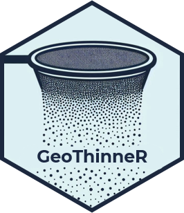
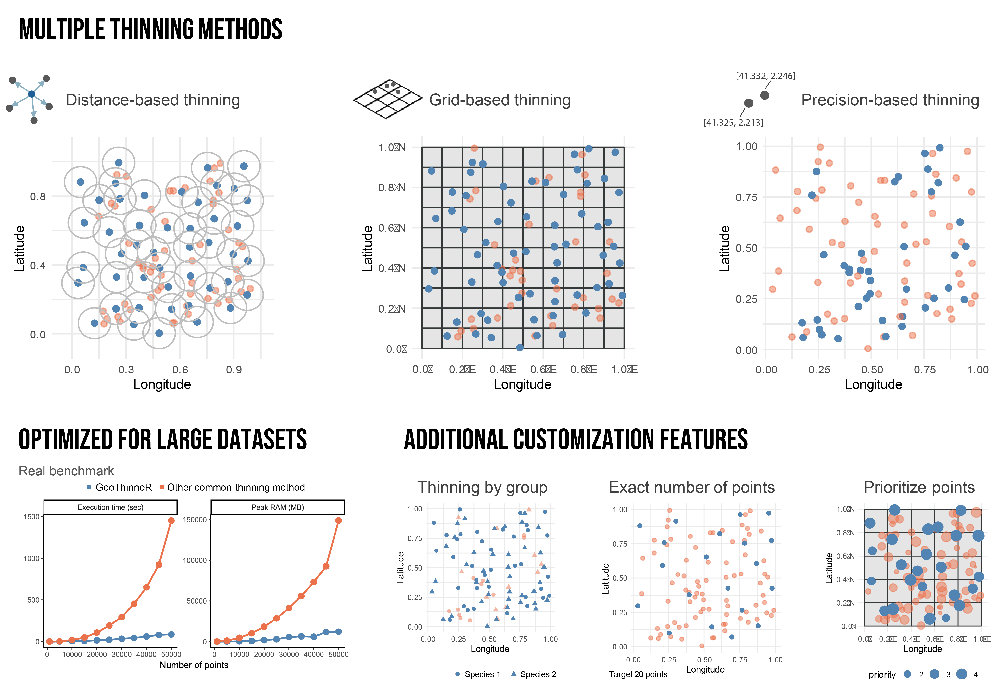

<!-- README.md is generated from README.Rmd. Please edit that file -->

# GeoThinneR - An R Package for Spatial Thinning <a href="https://jmestret.github.io/GeoThinneR/"></a>

<!-- badges: start -->

[](https://cran.r-project.org/package=GeoThinneR)
[](https://github.com/jmestret/GeoThinneR/actions/workflows/R-CMD-check.yaml)
[](https://app.codecov.io/gh/jmestret/GeoThinneR)
<!-- badges: end -->

## Overview

**GeoThinneR** is an R package designed for efficient spatial thinning
of species occurrence records and other geospatial point data. It
integrates three primary thinning methods (**distance-based, grid-based,
and precision-based thinning**) into a single package, eliminating the
need to switch between multiple tools. GeoThinneR implements algorithms
based on kd-tree structures for nearest-neighbor searches, significantly
improving performance and **scalability for large datasets**.
Additionally, the package provides custom **functionalities** useful for
species distribution modeling (SDM), such as thinning by group (e.g.,
multiple species), retaining an exact number of points, and prioritizing
records based on user-defined variables. These features make GeoThinneR
a valuable tool for handling large-scale occurrence datasets.



GeoThinneR has been developed as an alternative tool for spatial
thinning to mitigate the effects of sampling bias in SDM. Various
approaches exist to address sampling bias, each suited to different
scenarios. Below are some references discussing methods for bias
correction and spatial thinning:

- Boria, R. A., Olson, L. E., Goodman, S. M., & Anderson, R. P. (2014).
  Spatial filtering to reduce sampling bias can improve the performance
  of ecological niche models. *Ecological modelling, 275*, 73-77.
  <https://doi.org/10.1016/j.ecolmodel.2013.12.012>
- Veloz, S. D. (2009). Spatially autocorrelated sampling falsely
  inflates measures of accuracy for presence‐only niche models. *Journal
  of biogeography, 36*(12),
  2290-2299.<https://doi.org/10.1111/j.1365-2699.2009.02174.x>
- Moudrý, V., Bazzichetto, M., Remelgado, R., Devillers, R., Lenoir, J.,
  Mateo, R.G., Lembrechts, J.J., Sillero, N., Lecours, V., Cord, A.F.,
  Barták, V., Balej, P., Rocchini, D., Torresani, M., Arenas-Castro, S.,
  Man, M., Prajzlerová, D., Gdulová, K., Prošek, J., Marchetto, E.,
  Zarzo-Arias, A., Gábor, L., Leroy, F., Martini, M., Malavasi, M.,
  Cazzolla Gatti, R., Wild, J. and Šímová, P. (2024), Optimising
  occurrence data in species distribution models: sample size,
  positional uncertainty, and sampling bias matter. *Ecography, 2024*:
  e07294. <https://doi.org/10.1111/ecog.07294>

## Getting started

You can install **GeoThinneR** from CRAN with:

``` r
install.packages("GeoThinneR")
```

To install the **development version** from GitHub, use:

``` r
# install.packages("devtools")
devtools::install_github("jmestret/GeoThinneR")
```

Using GeoThinneR is simple. The main function, `thin_points()`, applies
spatial thinning using a user-specified method and thinning constraint.

``` r
library(GeoThinneR)

# Distance-based thinning (minimum separation of 10 km)
thin_points(data, method = "distance", thin_dist = 10)

# Grid-based thinning (grid resolution of 0.1 degrees)
thin_points(data, method = "grid", resolution = 0.1)

# Precision-based thinning (rounding coordinates to 1 decimal place)
thin_points(data, method = "precision", precision = 1)
```

## Documentation

For detailed documentation, guides, and usage examples, please visit the
[official package
documentation](https://jmestret.github.io/GeoThinneR/).

## Contributing

We welcome contributions! If you have suggestions for improvements or
new features, please open an issue or submit a pull request on our
[GitHub repository](https://github.com/jmestret/GeoThinneR).

## How to cite GeoThinneR

The GeoThinneR paper is currently in preparation. Meanwhile, you can
cite the package using:

> Mestre-Tomás J (2025). GeoThinneR: Efficient Spatial Thinning of
> Species Occurrences. R package version 2.0.0,
> <https://github.com/jmestret/GeoThinneR>
