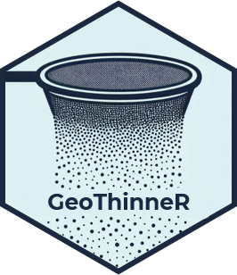
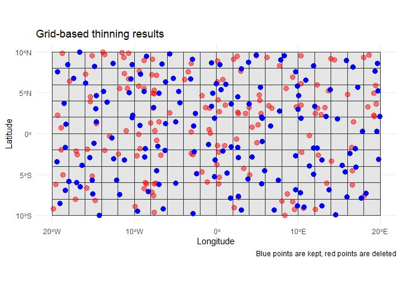

<!-- README.md is generated from README.Rmd. Please edit that file -->

# GeoThinneR <a href="https://jmestret.github.io/GeoThinneR/"></a>

<!-- badges: start -->

[](https://cran.r-project.org/package=GeoThinneR)
[](https://github.com/jmestret/GeoThinneR/actions/workflows/R-CMD-check.yaml)
[](https://app.codecov.io/gh/jmestret/GeoThinneR)
<!-- badges: end -->

## Overview

**GeoThinneR** is an R package designed for spatial thinning of species
occurrences and other types of geospatial point data. It offers a
collection of thinning methods, including distance-based, grid-based,
and precision-based algorithms. Whether you’re working on species
distribution models (SDMs), ecological niche modeling, or managing
biodiversity datasets, GeoThinneR provides tools that can help you
correct sampling bias, reduce spatial autocorrelation, and improve model
performance. Users can choose between different thinning algorithms
depending on their specific needs, including the ability to perform
thinning using a grouping variable, to specify a target number of
points, or to apply preference filtering based on uncertainty or other
criteria.

## Installation

You can install GeoThinneR from CRAN using the following command:

``` r
install.packages("GeoThinneR")
```

To install the development version of GeoThinneR from GitHub, use:

``` r
# install.packages("devtools")
devtools::install_github("jmestret/GeoThinneR")
```

Optionally, to use R-trees you need to install:

``` r
devtools::install_github("jmestret/rtree")
```

## How to Use GeoThinneR

The documentation can be found at
<https://jmestret.github.io/GeoThinneR/>. Below are some examples
demonstrating how to use the package for different spatial thinning
methods.

### Example 1: Distance-based thinning

In this example, we will use the brute force method to thin points based
on a specified distance:

``` r
library(GeoThinneR)

# Simulated data (longitude, latitude)
set.seed(1234)
sim_data <- data.frame(long = runif(100, -76, -75), lat = runif(100, 39, 40))


# Thinning the points with a distance of 30 km
thin_distance <- thin_points(
  data = sim_data,
  method = "brute_force",
  thin_dist = 15,
  trials = 50,
  seed = 1234
)

# View the number of kept points
nrow(thin_distance[[1]])
#> [1] 29
```


### Example 2: Grid-based thinning with a raster file

In this example, we will use a grid sampling method with a raster file
to thin the data:

``` r
library(GeoThinneR)
library(terra)

# Create a raster object
rast_obj <- rast(xmin = -20, xmax = 20, ymin = -10, ymax = 10, res = 2)

# Simulated data (longitude, latitude)
set.seed(1234)
sim_data <- data.frame(long = runif(300, -20, 20), lat = runif(300, -10, 10))

# Perform grid-based thinning
thin_grid <- thin_points(
  data = sim_data,
  method = "grid",
  raster_obj = rast_obj,
  trials = 50,
  seed = 1234
)

# View the number of kept points
nrow(thin_grid[[1]])
#> [1] 149
```

    #> Linking to GEOS 3.11.2, GDAL 3.8.2, PROJ 9.3.1; sf_use_s2() is TRUE



### Example 3: Precision-based thinning with grouping variable

In this example, we will perform precision-based thinning while
considering a grouping variable:

``` r
library(GeoThinneR)

# Simulated data with a grouping variable
set.seed(1234)
sim_data <- data.frame(
  long = runif(100, 10.5, 11),
  lat = runif(100, 10.5, 11),
  group = sample(c("species_1", "species_2"), 100, replace = TRUE)
)

# Perform precision-based thinning with grouping
thin_precision <- thin_points(
  data = sim_data,
  method = "precision",
  precision = 1,  # rounding precision
  group_col = "group",  # grouping variable
  trials = 50,
  seed = 1234
)

# View the number of kept points
nrow(thin_precision[[1]])
#> [1] 51
```


For more details on the various methods available in **GeoThinneR** and
additional functionalities like keeping an exact number of points or
filtering according to a preference variable, please refer to the
package website or the documentation.

## Contributing

We welcome contributions! If you have suggestions for improvements or
new features, please open an issue or submit a pull request on our
[GitHub repository](https://github.com/jmestret/GeoThinneR).

## How to cite GeoThinneR

The GeoThinneR paper is currently in progress. Meanwhile, you can
reference the GitHub repository as follows:

Mestre-Tomás, J. (2024). GeoThinneR: An R package for simple spatial
thinning methods in ecological and spatial analysis. R package version
1.0.0, <https://github.com/jmestret/GeoThinneR>
