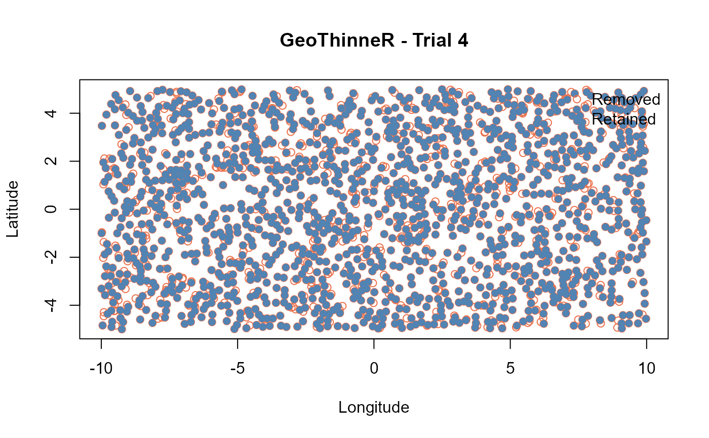
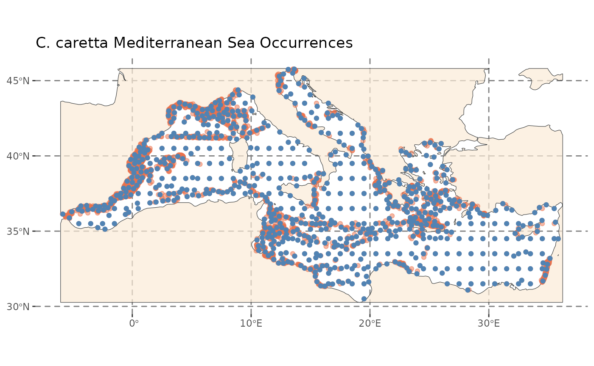
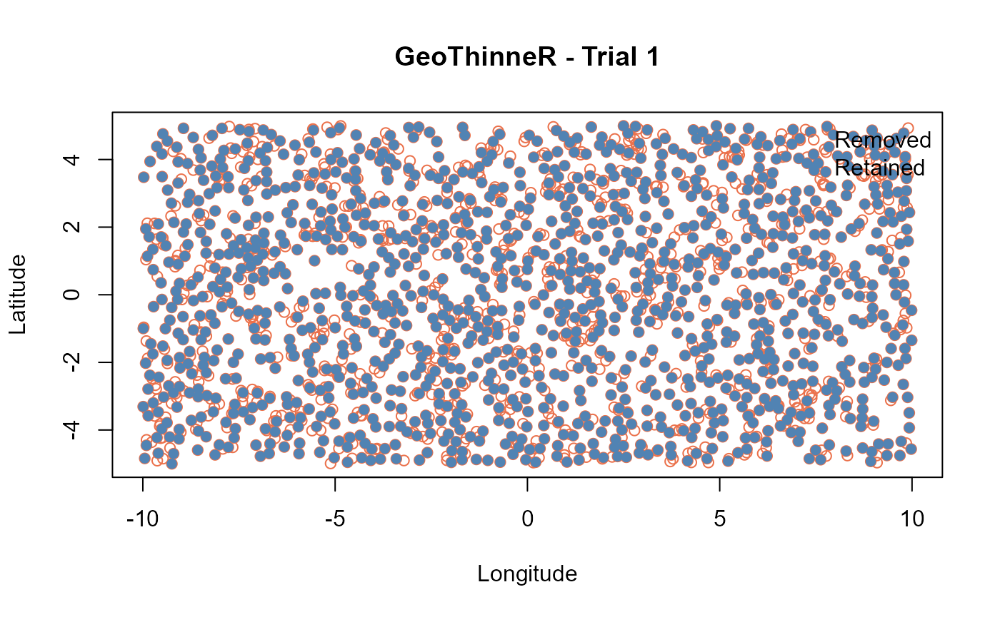
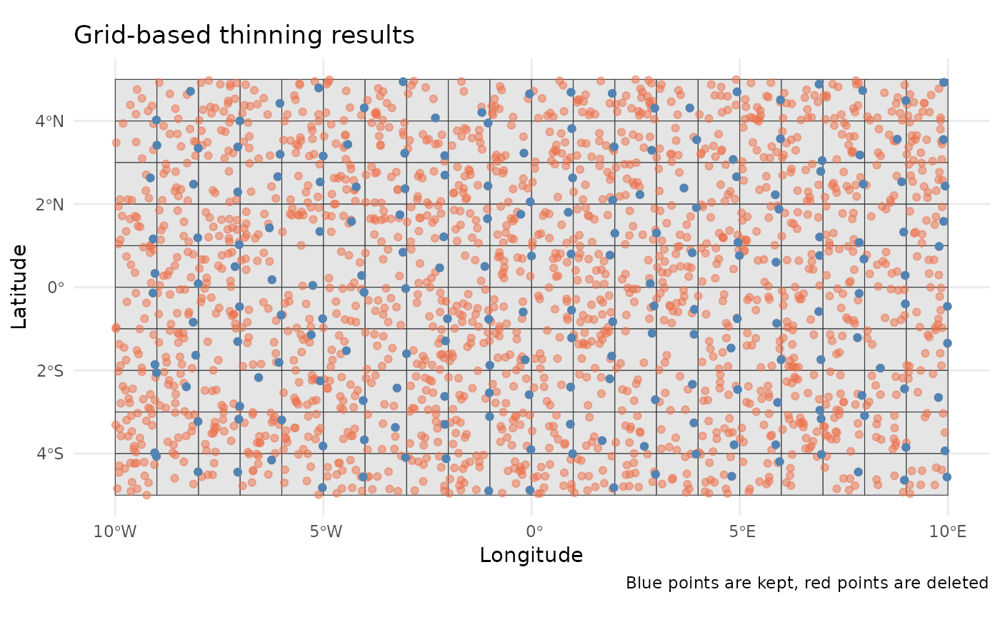
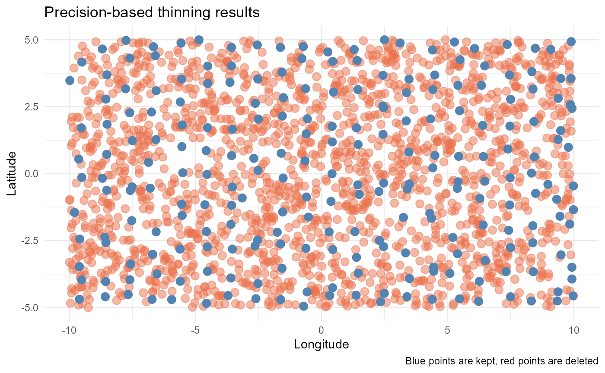
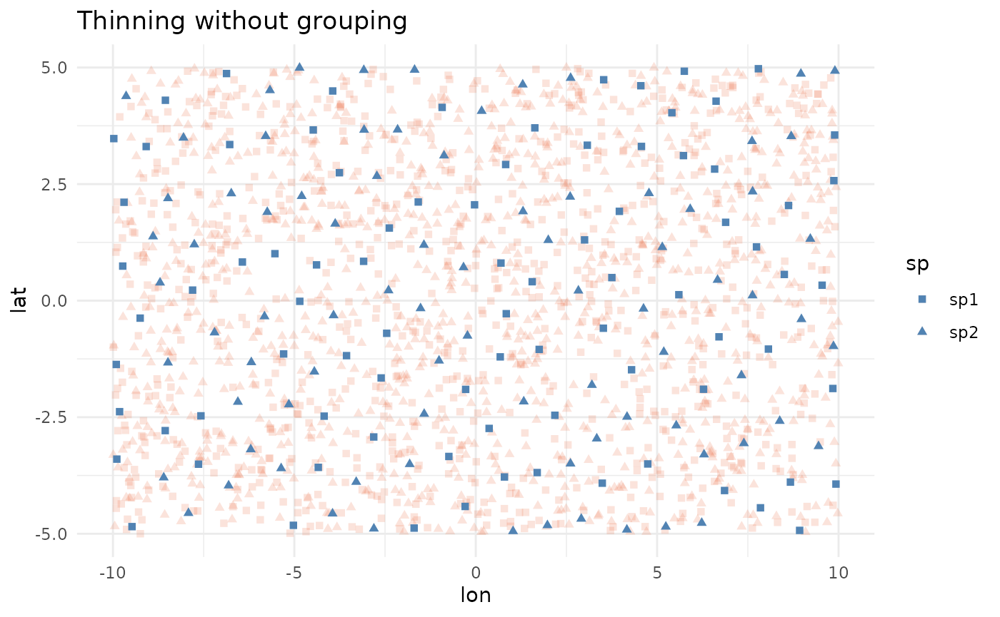
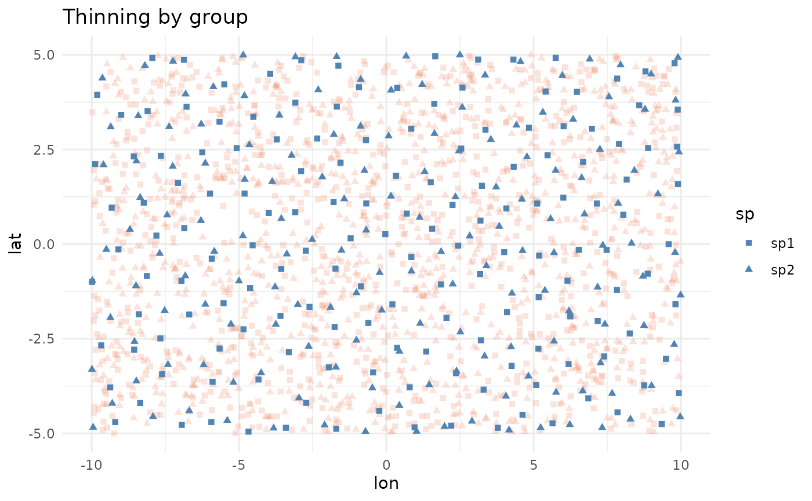
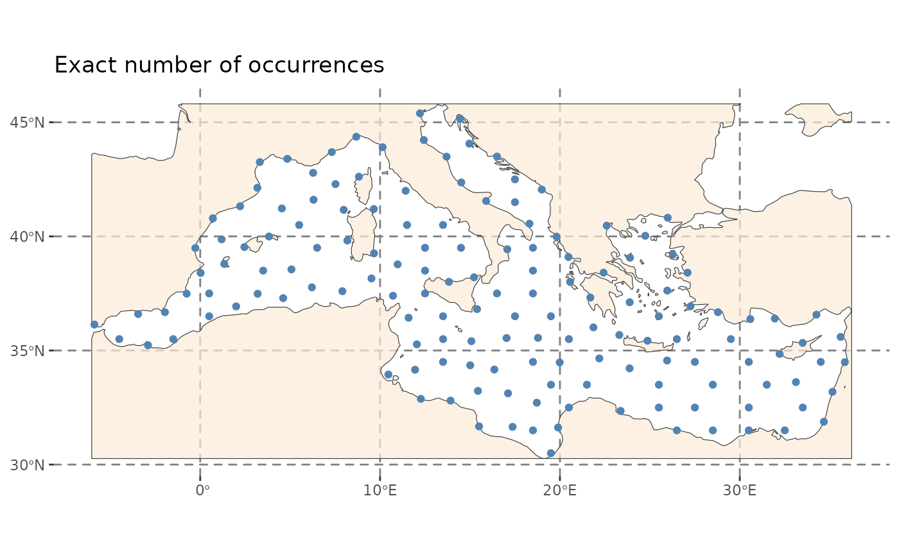

# Getting started with GeoThinneR

## Overview

**GeoThinneR** is an R package designed for efficient spatial thinning
of point data, particularly useful for species occurrence data and other
spatial analyses. It implements optimized neighbor search algorithms
based on *kd*-trees, providing an **efficient, scalable, and
user-friendly** approach. When working with large-scale datasets
containing hundreds of thousands of points, applying thinning manually
is not possible, and existing tools in R providing thinning methods for
species distribution modeling often lack scalability and computational
efficiency.

Spatial thinning is widely used across many disciplines to **reduce the
density of spatial point data** by selectively removing points based on
specified criteria, such as threshold spacing or grid cells. This
technique is applied in fields like remote sensing, where it improves
data visualization and processing, as well as in geostatistics, and
spatial ecological modeling. Among these, species distribution modeling
is a key area where thinning plays a crucial role in mitigating the
effects of spatial sampling bias.

This vignette provides a step-by-step guide to thinning with
**GeoThinneR** using both simulated and real-world datasets.

## Setup and loading data

To get started with **GeoThinneR**, we begin by loading the packages
used in this vignette:

``` r
library(GeoThinneR)
library(terra)
library(sf)
library(ggplot2)
```

We’ll use two dataset to demonstrate the use of **GeoThinneR**:

1.  A **simulated a dataset** with `n = 2000` random occurrences
    randomly distributed within a 20 x 10 degree area for two artificial
    species.
2.  A **real-world dataset** containing loggerhead sea turtle (*Caretta
    caretta*) occurrences in the Mediterranean Sea downloaded from
    [GBIF](https://doi.org/10.15468/dl.9jcjrm) and included with the
    package.

``` r
# Set seed for reproducibility
set.seed(123)

# Simulated dataset
n <- 2000
sim_data <- data.frame(
  lon = runif(n, min = -10, max = 10),
  lat = runif(n, min = -5, max = 5),
  sp = sample(c("sp1", "sp2"), n, replace = TRUE)
)

# Load real-world occurrence dataset
data("caretta")

# Load Mediterranean Sea polygon
medit <- system.file("extdata", "mediterranean_sea.gpkg", package = "GeoThinneR")
medit <- sf::st_read(medit)
```

Let’s visualize the datasets before thinning:


## Quick start guide

Now that our data is ready, let’s use **GeoThinneR** for spatial
thinning. All methods are accessed through the
[`thin_points()`](https://jmestret.github.io/GeoThinneR/reference/thin_points.md)
function, which requires, at a minimum, a dataset containing
georeferenced points (WGS84 CRS - EPSG:4326) in `matrix`, `data.frame`,
or `tibble` format. The query dataset is provided through the `data`
argument, and with `lon_col` and `lat_col` parameters, we can define the
column names containing longitude and latitude (or x, y) coordinates.
Default values are “lon” and “lat”, and if not present, it will take the
first two columns by default.

The **thinning method** is defined using the `method` parameter, with
the following options:

- `"distance"`: Distance-based thinning  
- `"grid"`: Grid-based thinning  
- `"precision"`: Precision-based thinning

The **thinning constraint** (distance, grid resolution or decimal
precision) depends on the method chosen (these will be detailed in the
next section). Regardless of the method, the algorithm selects which
points to retain and remove. Since this selection is non-deterministic,
you can run **multiple randomized thinning trials** to maximize the
number of retained points.

Let’s quickly thin the simulated dataset using a simple distance-based
method:

``` r
# Apply spatial thinning to the simulated data
quick_thin <- thin_points(
  data = sim_data,     # Dataframe with coordinates
  lon_col = "lon",     # Longitude column name
  lat_col = "lat",     # Latitude column name
  method = "distance", # Method for thinning
  thin_dist = 20,      # Thinning distance in km,
  trials = 5,          # Number of trials
  all_trials = TRUE,   # Return all trials
  seed = 123           # Seed for reproducibility
)

quick_thin
#> GeoThinned object
#> Method used: distance 
#> Number of trials: 5 (5 trials returned)
#> Points retained in largest trial: 1390
```

This command applies spatial thinning ensuring no two retained points
are closer than 20 km (`thin_dist`). We specified to run 5 random trials
(`trials`). By default, it returns only the trial that retains the
largest subset of points, but because we set `all_trials = TRUE`, all
trials are returned.

#### Exploring the GeoThinned object

The output of
[`thin_points()`](https://jmestret.github.io/GeoThinneR/reference/thin_points.md)
is a `GeoThinned` object, which contains: - `x$retained`: a list of
logical vectors indicating which points were retained in each trial -
`x$method`: the method used for thinning - `x$params`: the parameters
used for thinning - `x$original_data`: the original dataset

You can apply basic methods for inspecting the object such as
[`print()`](https://rdrr.io/r/base/print.html),
[`summary()`](https://rspatial.github.io/terra/reference/summary.html),
and [`plot()`](https://rspatial.github.io/terra/reference/plot.html).
The
[`summary()`](https://rspatial.github.io/terra/reference/summary.html)
function provides detailed information about the thinning process,
including the number of points retained after thinning, the nearest
neighbor distance (NND), and the spatial coverage of the retained
points. By default, the summary shows the metrics for the trial that
retains the largest number of points, but you can also specify a
specific trial using the `trial` argument.

``` r
summary(quick_thin)
#> Summary of GeoThinneR Results
#> -----------------------------
#> Trial summarized  : 1 
#> Method used       : distance 
#> Distance metric   : haversine 
#> 
#> Number of points:
#>   Original              2000
#>   Thinned               1390
#>   Retention ratio      0.695
#> 
#> Nearest Neighbor Distances [km]
#>             Min 1st Qu. Median   Mean 3rd Qu.   Max
#> Original  0.650  11.011 17.159 18.216  24.265 61.83
#> Thinned  20.015  23.205 26.774 28.098  31.418 61.83
#> 
#> Spatial Coverage (Convex Hull Area) [km2]
#>   Original        2458025.112
#>   Thinned         2452182.016
```

We see that from 2000, we retained the 69.5% of points (1390), and the
minimum distance between points has increased without reducing too much
the spatial coverage or extent of the points compared to the original
dataset.

``` r
plot(quick_thin)
```



If we check the number of points retained in each trial, we can see that
the 5 trials return different numbers of points retained. This is due to
the randomness of the algorithm when selecting which points to retain.
You can use `seed` for reproducibility. By setting, `all_trials = FALSE`
it will just return the trial that kept the most points.

``` r
# Number of kept points in each trial
sapply(quick_thin$retained, sum)
#> [1] 1390 1388 1388 1388 1387
```

You can access the thinned dataset that retained the maximum number of
points using the
[`largest()`](https://jmestret.github.io/GeoThinneR/reference/GeoThinned.md)
function.

``` r
head(largest(quick_thin))
#>          lon        lat  sp
#> 1 -4.2484496 -3.4032602 sp2
#> 2  5.7661027 -3.5548415 sp2
#> 3 -1.8204616 -3.5081961 sp2
#> 4  7.6603481  0.1443426 sp1
#> 6 -9.0888700  1.1634277 sp1
#> 7  0.5621098 -0.5257711 sp1
```

If you want to access points from a specific trial, you can use the
[`get_trial()`](https://jmestret.github.io/GeoThinneR/reference/GeoThinned.md)
function, which returns the thinned dataset for that trial.

``` r
head(get_trial(quick_thin, trial = 2)) 
#>          lon        lat  sp
#> 1 -4.2484496 -3.4032602 sp2
#> 3 -1.8204616 -3.5081961 sp2
#> 4  7.6603481  0.1443426 sp1
#> 6 -9.0888700  1.1634277 sp1
#> 7  0.5621098 -0.5257711 sp1
#> 8  7.8483809 -4.4432328 sp1
```

Just in case you want to get the points that were removed from the
original dataset, you can use the `retained` list to index the original
data. The `retained` list contains logical vectors indicating which
points were retained in each trial. You can use this to filter the
original data and get the removed points.

``` r
trial <- 2
head(quick_thin$original_data[!quick_thin$retained[[trial]], ])
#>         lon         lat  sp
#> 2  5.766103 -3.55484149 sp2
#> 5  8.809346 -0.07172694 sp1
#> 11 9.136667  3.50963224 sp2
#> 20 9.090073 -4.96464505 sp2
#> 21 7.790786  4.97424144 sp1
#> 23 2.810136  4.97688745 sp1
```

Also, you can use
[`as_sf()`](https://jmestret.github.io/GeoThinneR/reference/GeoThinned.md)
to convert the thinned dataset to a `sf` object, which is useful for
plotting and spatial analysis.

``` r
sf_thinned <- as_sf(quick_thin)
class(sf_thinned)
#> [1] "sf"         "data.frame"
```

#### Real-world example

GeoThinneR includes a dataset of loggerhead sea turtle (*Caretta
caretta*) occurrence records in the Mediterranean Sea, sourced from GBIF
and filtered. We now apply a 30 km thinning distance, returning only the
largest trial (the one with the maximum number of points retained,
`all_trials` set to `FALSE`).

``` r
# Apply spatial thinning to the real data
caretta_thin <- thin_points(
  data = caretta, # We will not specify lon_col, lat_col as they are in position 1 and 2
  lat_col = "decimalLatitude",
  lon_col = "decimalLongitude",
  method = "distance",
  thin_dist = 30, # Thinning distance in km,
  trials = 5,
  all_trials = FALSE,
  seed = 123
)

# Thinned dataframe stored in the first element of the retained list
identical(largest(caretta_thin), get_trial(caretta_thin, 1))
#> [1] TRUE
```



As you can see, with **GeoThinneR**, it’s very easy to apply spatial
thinning to your dataset. In the next section we explain the different
thinning methods and how to use them, and also the implemented
optimizations for large-scale datasets.

## Thinning methods

**GeoThinneR** offers different algorithms for spatial thinning. In this
section, we will show how to use each thinning method, highlighting its
unique parameters and features.

### Distance-based thinning

Distance-based thinning (`method="distance"`) ensures that all retained
points are separated by at least a user-defined minimum distance
`thin_dist` (in km). For geographic coordinates, using
`distance = "haversine"` (default) computes great-circle distances, or
alternatively, the Euclidean distance between 3D Cartesian coordinates
(depending on the method) to identify neighboring points within the
distance threshold. The algorithm iterates through the dataset and
removes points that are too close to each other.

In general, the choice of search method depends on the size of the
dataset and the desired thinning distance:

- `search_type="brute"`: Useful for small datasets, low scalability.
- `search_type="kd_tree"`: More memory-efficient, better scalability for
  medium-sized datasets.
- `search_type="local_kd_tree"` (default): Faster than `"kd_tree"` and
  reduces memory usage. Can be parallelized to improve speed.
- `search_type="k_estimation"`: Very fast when the number of points to
  remove is low or not very clustered, if not similar or worse than
  `"local_kd_tree"`.

You can find the benchmarking results for each method in the package
manuscript (see references).

``` r
dist_thin <- thin_points(sim_data, method = "distance", thin_dist = 25, trials = 3)
plot(dist_thin)
```



#### Brute force

This is the most common greedy method for calculating the distance
between points (`search_type="brute"`), as it directly computes all
pairwise distances and retains points that are far enough apart based on
the thinning distance. By default, it computes the Haversine distance
using the `rdist.earth()` function from the **fields** package. If
`distance = "euclidean"`, it computes the Euclidean distance instead.
The main advantage of this method is that it computes the full distance
matrix between your points. However, the main disadvantage is that it is
very time and memory consuming, as it requires computing all pairwise
comparisons.

``` r
brute_thin <- thin_points(
  data = sim_data,
  method = "distance",
  search_type = "brute",
  thin_dist = 20,
  trials = 10,
  all_trials = FALSE,
  seed = 123
)
nrow(largest(brute_thin))
#> [1] 1390
```

#### Traditional *kd*-tree

A *kd*-tree is a binary tree that partitions space into regions to
optimize nearest neighbor searches. The `search_type="kd_tree"` method
uses the **nabor** R package to implement *kd*-trees via the **libnabo**
library. This method is more memory-efficient than brute force. Since
this implementation of *kd*-trees is based on Euclidean distance, when
working with geographic coordinates (`distance = "haversine"`),
**GeoThinneR** transforms the coordinates into XYZ Cartesian
coordinates. Although this method scales better than the brute-force
method for large datasets, since we want to identify all neighboring
points of each query point, its performance can still be improved for
very large datasets.

``` r
kd_tree_thin <- thin_points(
  data = sim_data,
  method = "distance",
  search_type = "kd_tree",
  thin_dist = 20,
  trials = 10,
  all_trials = FALSE,
  seed = 123
)
nrow(largest(kd_tree_thin))
#> [1] 1390
```

#### Local *kd*-trees

To reduce the complexity of searching within a single huge *kd*-tree
containing all points from the dataset, we propose a simple
modification: creating small local *kd*-trees by dividing the spatial
domain into multiple smaller regions, each with its own tree
(`search_type="local_kd_tree"`). This notably reduces memory usage,
allowing this thinning method to be used for very large datasets on
personal computers. Additionally, you can run in parallel this method to
improve speed using the `n_cores` parameter.

``` r
local_kd_tree_thin <- thin_points(
  data = sim_data,
  method = "distance",
  search_type = "local_kd_tree",
  thin_dist = 20,
  trials = 10,
  all_trials = FALSE,
  seed = 123
)
nrow(largest(local_kd_tree_thin))
#> [1] 1390
```

#### Restricted neighbor search

Another way to reduce the computational complexity of *kd*-tree neighbor
searches is by limiting the number of neighbors to find. In the
[`nabor::knn()`](https://rdrr.io/pkg/nabor/man/knn.html) function, we
can specify the number of neighbors to search for (`k`). For spatial
thinning, we need to identify all neighbors for each point, which
increases computational cost by setting `k` to the total number of
points (`n`). However, with the `search_type="k_estimation"` method, we
can estimate the maximum number of neighbors a point can have based on
the spatial density of points, thereby reducing the `k` parameter. This
method is particularly useful when datasets are not highly clustered, as
it estimates a smaller `k` value, significantly reducing computational
complexity.

``` r
k_estimation_thin <- thin_points(
  data = sim_data,
  method = "distance",
  search_type = "k_estimation",
  thin_dist = 20,
  trials = 10,
  all_trials = FALSE,
  seed = 123
)
nrow(largest(k_estimation_thin))
#> [1] 1390
```

### Grid-based thinning

Grid sampling is a standard method where the area is divided into a
grid, and `n` points are sampled from each grid cell. This method is
very fast and memory-efficient. The only drawback is that you cannot
ensure a minimum distance between points. There are two main ways to
apply grid sampling in **GeoThinneR**: (i) define the characteristics of
the grid, or (ii) pass your own grid as a raster
([`terra::SpatRaster`](https://rspatial.github.io/terra/reference/SpatRaster-class.html)).

For the first method, you can use the `thin_dist` parameter to define
the grid cell size (the distance in km will be approximated to degrees
to define the grid cell size, one degree roughly 111.32 km), or you can
pass the resolution of the grid (e.g., `resolution = 0.25` for
0.25x0.25-degree cells). If you want to align the grid with external
data or covariate layers, you can pass the `origin` argument as a tuple
of two values (e.g., `c(0, 0)`). Similarly, you can specify the
coordinate reference system (CRS) of your grid (`crs`).

``` r
system.time(
grid_thin <- thin_points(
  data = sim_data,
  method = "grid",
  resolution = 1,
  origin = c(0, 0),
  crs = "epsg:4326",
  n = 1, # one point per grid cell
  trials = 10,
  all_trials = FALSE,
  seed = 123
))
#>    user  system elapsed 
#>   0.018   0.000   0.015
nrow(largest(grid_thin))
#> [1] 200
```

Alternatively, you can pass a
[`terra::SpatRaster`](https://rspatial.github.io/terra/reference/SpatRaster-class.html)
object, and that grid will be used for the thinning process.

``` r
rast_obj <- terra::rast(xmin = -10, xmax = 10, ymin = -5, ymax = 5, res = 1)
system.time(
grid_raster_thin <- thin_points(
  data = sim_data,
  method = "grid", 
  raster_obj = rast_obj,
  trials = 10,
  n = 1,
  all_trials = FALSE,
  seed = 123
))
#>    user  system elapsed 
#>   0.005   0.000   0.003
nrow(largest(grid_raster_thin))
#> [1] 200
```



### Precision thinning

In this approach, coordinates are rounded to a certain precision to
remove points that fall too close together. After removing points based
on coordinate precision, the coordinate values are restored to their
original locations. This is the simplest method and is more of a
filtering when working with data from different sources with varying
coordinate precision. To use it, you need to define the `precision`
parameter, indicating the number of decimals to which the coordinates
should be rounded.

``` r
system.time(
precision_thin <- thin_points(
  data = sim_data,
  method = "precision", 
  precision = 0,
  trials = 50,
  all_trials = FALSE,
  seed = 123
))
#>    user  system elapsed 
#>   0.003   0.000   0.003
nrow(largest(precision_thin))
#> [1] 230
```



These are the methods implemented in **GeoThinneR**. Depending on your
specific dataset and research needs, one method may be more suitable
than others.

## Additional customization features

### Spatial thinning by group

In some cases, your dataset may include different groups, such as
species, time periods, areas, or conditions, that you want to thin
independently. The `group_col` parameter allows you to specify the
column containing the grouping factor, and the thinning will be
performed separately for each group. For example, in the simulated data
where we have two species, we can use this parameter to thin each
species independently:

``` r
all_thin <- thin_points(
  data = sim_data,
  thin_dist = 100,
  seed = 123
)
grouped_thin <- thin_points(
  data = sim_data,
  group_col = "sp",
  thin_dist = 100,
  seed = 123
)

nrow(largest(all_thin))
#> [1] 167
nrow(largest(grouped_thin))
#> [1] 319
```



### Fixed number of points

What if you need to retain a fixed number of points that best covers the
area where your data points are located, or for class balancing? The
`target_points` parameter allows you to specify the number of points to
keep, and the function will return that number of points spaced as
separated as possible. Additionally, you can also set a `thin_dist`
parameter so that no points closer than this distance will be retained.
Currently, this approach is only implemented using the brute force
method (`method = "distance"` and `search_type = "brute"`), so be
cautious when applying it to very large datasets.

``` r
targeted_thin <- thin_points(
  data = caretta,
  lon_col = "decimalLongitude",
  lat_col = "decimalLatitude",
  target_points = 150,
  thin_dist = 30,
  all_trials = FALSE,
  seed = 123,
  verbose = TRUE
)
#> Starting spatial thinning at 2025-11-25 07:57:17 
#> Thinning using method: distance
#> For specific target points, brute force method is used.
#> Thinning process completed.
#> Total execution time: 4.11 seconds
nrow(largest(targeted_thin))
#> [1] 150
```



### Select points by priority

In some scenarios, you may want to prioritize certain points based on a
specific variable, such as coordinate uncertainty, data quality, or any
other variable. The `priority` parameter allows you to assign a numeric
weight to each point, where higher values indicate higher importance,
and these points are more likely to be retained during thinning. This
feature is available for the `"distance"`, `"grid"` and `"precision"`
methods.

For example, in the sea turtle data downloaded from GBIF, there is a
column named `coordinateUncertaintyInMeters`. To prioritize records with
lower uncertainty, you can invert the values so that smaller
uncertainties receive higher priority. A simple way to do this is:

``` r
# Invert uncertainty to give more priority to lower uncertainty records
priority <- -caretta$coordinateUncertaintyInMeters

# For example, handle NAs by assigning lowest possible priority
priority[is.na(priority)] <- min(priority, na.rm = TRUE) - 1
```

Then apply thinning using the priority weights:

``` r
# Standard grid thinning (no priority)
grid_thin <- thin_points(
  data = caretta,
  lon_col = "decimalLongitude",
  lat_col = "decimalLatitude",
  method = "grid",
  resolution = 2,
  seed = 123
)

# Grid thinning with priority
priority_thin <- thin_points(
  data = caretta,
  lon_col = "decimalLongitude",
  lat_col = "decimalLatitude",
  method = "grid",
  resolution = 2,
  priority = priority,
  seed = 123
)

mean(largest(grid_thin)$coordinateUncertaintyInMeters, na.rm = TRUE)
#> [1] 35513.54
mean(largest(priority_thin)$coordinateUncertaintyInMeters, na.rm = TRUE)
#> [1] 138288
```

**Notes**

- Higher `priority` values mean the point is more likely to be retained.
- In `"grid"` and `"precision"` methods, when multiple points fall into
  the same grid cell or rounded coordinate, the one with highest
  priority is kept.
- In the `"distance"` method, priority is used to resolve tie situations
  where multiple points have the same spatial influence; the point with
  lowest priority is dropped.
- If multiple points have the same priority, one is selected at random.
- By default, if provided `NA` values in `priority`, they are treated as
  the lowest possible priority.

## Other Packages

The **GeoThinneR** package was inspired by the work of many others who
have developed methods and packages for working with spatial data and
thinning techniques. Our goal with **GeoThinneR** is to offer additional
flexibility in method selection and to address specific needs we
encountered while using other packages. We would like to mention other
tools that may be suitable for your work:

- **spThin**: The `thin()` function provides a brute-force spatial
  thinning of data, maximizing the number of retained points through
  random iterative repetitions, using the Haversine distance.
- **enmSdmX**: Includes the `geoThin()` function, which calculates all
  pairwise distances between points for thinning purposes.
- **dismo**: The `gridSample()` function samples points using a grid as
  stratification, providing an efficient method for spatial thinning.

## References

- Aiello‐Lammens, M. E., Boria, R. A., Radosavljevic, A., Vilela, B.,
  and Anderson, R. P. (2015). *spThin: an R package for spatial thinning
  of species occurrence records for use in ecological niche models*.
  Ecography, 38(5), 541-545. <https://doi.org/10.1111/ecog.01132>

- Elseberg, J., Magnenat, S., Siegwart, R., & Nüchter, A. (2012).
  *Comparison of nearest-neighbor-search strategies and implementations
  for efficient shape registration*. Journal of Software Engineering for
  Robotics, 3(1), 2-12. <https://hdl.handle.net/10446/86202>

- Hijmans, R.J., Phillips, S., Leathwick, J., & Elith, J. (2023).
  *dismo: Species Distribution Modeling*. R Package Version 1.3-14.
  <https://cran.r-project.org/package=dismo>

- Mestre-Tomás J (2025). GeoThinneR: Efficient Spatial Thinning of
  Species Occurrences. R package version 2.0.0,
  <https://github.com/jmestret/GeoThinneR>

- Smith, A. B., Murphy, S. J., Henderson, D., & Erickson, K. D. (2023).
  *Including imprecisely georeferenced specimens improves accuracy of
  species distribution models and estimates of niche breadth*. Global
  Ecology and Biogeography, 32(3), 342-355.
  <https://doi.org/10.1111/geb.13628>

## Session info

``` r
sessionInfo()
#> R version 4.5.2 (2025-10-31)
#> Platform: x86_64-pc-linux-gnu
#> Running under: Ubuntu 24.04.3 LTS
#> 
#> Matrix products: default
#> BLAS:   /usr/lib/x86_64-linux-gnu/openblas-pthread/libblas.so.3 
#> LAPACK: /usr/lib/x86_64-linux-gnu/openblas-pthread/libopenblasp-r0.3.26.so;  LAPACK version 3.12.0
#> 
#> locale:
#>  [1] LC_CTYPE=C.UTF-8       LC_NUMERIC=C           LC_TIME=C.UTF-8       
#>  [4] LC_COLLATE=C.UTF-8     LC_MONETARY=C.UTF-8    LC_MESSAGES=C.UTF-8   
#>  [7] LC_PAPER=C.UTF-8       LC_NAME=C              LC_ADDRESS=C          
#> [10] LC_TELEPHONE=C         LC_MEASUREMENT=C.UTF-8 LC_IDENTIFICATION=C   
#> 
#> time zone: UTC
#> tzcode source: system (glibc)
#> 
#> attached base packages:
#> [1] stats     graphics  grDevices utils     datasets  methods   base     
#> 
#> other attached packages:
#> [1] ggplot2_4.0.1    sf_1.0-22        terra_1.8-80     GeoThinneR_2.1.0
#> 
#> loaded via a namespace (and not attached):
#>  [1] s2_1.1.9           sass_0.4.10        class_7.3-23       KernSmooth_2.23-26
#>  [5] digest_0.6.39      magrittr_2.0.4     evaluate_1.0.5     grid_4.5.2        
#>  [9] RColorBrewer_1.1-3 iterators_1.0.14   fastmap_1.2.0      maps_3.4.3        
#> [13] foreach_1.5.2      jsonlite_2.0.0     e1071_1.7-16       DBI_1.2.3         
#> [17] spam_2.11-1        viridisLite_0.4.2  scales_1.4.0       codetools_0.2-20  
#> [21] textshaping_1.0.4  jquerylib_0.1.4    cli_3.6.5          rlang_1.1.6       
#> [25] units_1.0-0        withr_3.0.2        cachem_1.1.0       yaml_2.3.10       
#> [29] tools_4.5.2        vctrs_0.6.5        R6_2.6.1           matrixStats_1.5.0 
#> [33] proxy_0.4-27       lifecycle_1.0.4    classInt_0.4-11    nabor_0.5.0       
#> [37] fs_1.6.6           ragg_1.5.0         desc_1.4.3         pkgdown_2.2.0     
#> [41] bslib_0.9.0        gtable_0.3.6       glue_1.8.0         data.table_1.17.8 
#> [45] Rcpp_1.1.0         fields_17.1        systemfonts_1.3.1  xfun_0.54         
#> [49] knitr_1.50         farver_2.1.2       htmltools_0.5.8.1  rmarkdown_2.30    
#> [53] labeling_0.4.3     wk_0.9.4           dotCall64_1.2      compiler_4.5.2    
#> [57] S7_0.2.1
```
